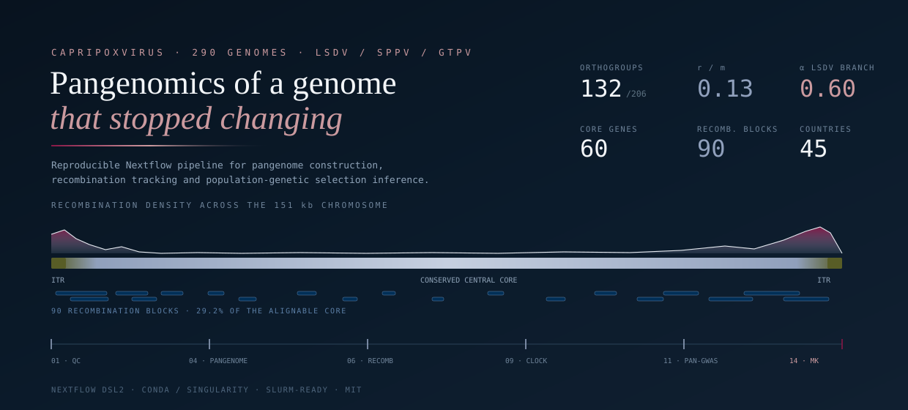

<p align="center">
  
</p>

<p align="center">
  <a href="https://www.nextflow.io/"></a>
  <a href="https://docs.conda.io/"></a>
  <a href="https://sylabs.io/"></a>
  <a href="https://doi.org/10.5281/zenodo.21996311"></a>
  <a href="LICENSE"></a>
</p>

---

## What this pipeline does

Capripoxviruses have large, slowly evolving double-stranded DNA genomes, and
that creates a specific analytical problem: the tools normally used to detect
selection assume there is enough synonymous variation to calibrate against.
Within Lumpy Skin Disease Virus there is not. Across 240 LSDV genomes the median
core gene carries **six distinct protein sequences**, synonymous rates collapse
towards zero at 88–96% of sites, and 30 of 56 testable genes return a
likelihood-ratio statistic of exactly zero.

This pipeline is built around that constraint. It reconstructs the pangenome,
maps recombination and population structure, and then deliberately runs the
codon-model scans **as a diagnostic** before falling back to a population-genetic
framework — a polarised McDonald-Kreitman test — that does not require
intra-population synonymous variation to be interpretable.

| Stage | What it answers |
|---|---|
| `01–04` Read QC, depletion, assembly, annotation | What is actually viral sequence, and what is host or bacterial carry-over |
| `05–06` Proteome QC and pangenome | How large is the core, and how open is the accessory repertoire |
| `07–08` Supermatrix and ML phylogeny | Does genomic structure follow host species |
| `09–10` Recombination and Bayesian clustering | Are circulating recombinants one lineage or many independent events |
| `11–12` Phylogeography and molecular clock | Can origin and timing be inferred, or does sampling bias forbid it |
| `13` Pan-GWAS | Which accessory genes associate with phenotype rather than with ancestry |
| `14–16` Selection scans, diagnostics, MK test | Where and when did adaptation actually occur |

## Quick start

```bash
# 1. install Nextflow
curl -s https://get.nextflow.io | bash

# 2. check the wiring on the bundled synthetic data (seconds, no tools needed)
nextflow run RaanaT1375/capripoxvirus-pangenome -profile test -stub-run --outdir results_test

# 3. run for real
nextflow run RaanaT1375/capripoxvirus-pangenome \
    -profile slurm,singularity \
    --input samplesheet.csv \
    --outdir results \
    --host_bowtie2_index /path/to/host_indices \
    --bacteria_mmi /path/to/Bacteria_Representative_DB.mmi
```

Resume a failed or extended run with `-resume`; completed stages are not recomputed.

## Samplesheet

One row per isolate. Provide **either** an assembly **or** FASTQ files, not both.

```csv
sample,species,host,country,year,condition,assembly,fastq_1,fastq_2
AF325528.1,LSDV,Bos taurus,Africa,2001,vaccine,refs/AF325528.1.fasta,,
SRR23419218,LSDV,Bos taurus,Europe,2021,field,,reads/SRR23419218_1.fq.gz,reads/SRR23419218_2.fq.gz
NC_004002.1,SPPV,Ovis aries,Asia,2002,field,refs/NC_004002.1.fasta,,
```

`condition` is one of `field`, `vaccine`, `recombinant`. `country` may be a
continent label if that is the resolution of your metadata; it is the trait used
for the phylogeographic and association analyses.

## Design decisions worth knowing about

These are choices, not defaults, and each of them changes the result.

**Bacterial depletion is selective, not universal.** Filtering every dataset
against a bacterial database also removes genuine lineage-specific accessory
genes, which is precisely the compartment under study. Instead every dataset is
assembled and annotated first; only assemblies whose predicted CDS count exceeds
`--cds_flag_threshold` (default 200, against the ~156 ORFs expected) are sent
back for depletion and re-assembly.

**Reads are never positively selected against the LSDV reference.** Retaining
only reference-matching reads biases recovered gene content towards the
reference and preferentially depletes the divergent terminal regions that carry
host-range and immunomodulatory loci. Depletion is therefore negative: a read
pair survives only if *both* mates fail to align to the bacterial reference set.

**Association significance requires two independent filters.** A gene-trait pair
is reported only if it satisfies both the per-trait Bonferroni correction and the
1,000-permutation empirical p-value. Either filter alone is substantially more
permissive. Convergent associations additionally require at least three
independent supporting evolutionary pairs, which is what separates adaptation
from lineage expansion.

**The MK frequency cutoff is swept, not assumed.** `--mk_freq_sweep` recomputes
the test across six cutoffs so the dependence of α on the threshold is reported
rather than hidden. Because divergence is defined against the outgroup
consensus, Dn and Ds are invariant across the sweep, which isolates the effect
on polymorphism alone.

## Outputs

```
results/
├── 01_read_qc/                fastp reports
├── 02_host_depletion/         Bowtie2 logs
├── 02_bacterial_depletion/    minimap2 retention statistics
├── 03_assembly/               filtered contigs per isolate
├── 04_annotation/             Prokka faa / ffn / gff / tsv
├── 05_pangenome_qc/           contamination and completeness verdicts
├── 06_pangenome/              orthogroups, presence/absence, Heaps' law fit
├── 07_supermatrix/            concatenated alignment and partition file
├── 08_phylogeny/              partitioned ML tree with bootstrap support
├── 09_recombination/          Parsnp core alignment, Gubbins blocks, r/m
├── 10_population_structure/   fastBAPS clusters and prior sensitivity
├── 11_phylogeography/         PastML ancestral states, full and sub-sampled
├── 12_temporal_signal/        root-to-tip distances and regression
├── 13_pangwas/                per-trait summary and significant pairs
├── 14_selection/              BUSTED, RELAX, aBSREL and dN/dS applicability
├── 15_mk_test/                polarised MK, threshold sweep, APOBEC diagnostic
└── pipeline_info/             timeline, report, trace, DAG, software versions
```

## Scripts

`bin/` holds portable command-line tools called by the pipeline. `bin/legacy/`
holds the scripts that produced the published results, preserved verbatim as the
provenance record. The McDonald-Kreitman stage calls the archived implementation
directly rather than a reimplementation, so that the published estimate is
reproduced exactly. See [`docs/scripts.md`](docs/scripts.md) for which is which,
and for the validation targets a full run should hit.

## Reproducing the published analysis

The dataset, parameters and results of the manuscript are archived at
[10.5281/zenodo.21996311](https://doi.org/10.5281/zenodo.21996311). Accession
numbers for all 290 genomes are in `Supplementary File S1`. Running this pipeline
with the archived samplesheet and default parameters reproduces the reported
core partition (132 strict-core orthogroups of 206), the recombination-to-mutation
ratio (0.13) and the polarised MK estimate (α = 0.604, 95% CI 0.33–0.75).

## Citation

If you use this pipeline, please cite the manuscript and the archived release.
Machine-readable metadata is in [`CITATION.cff`](CITATION.cff).

Tool citations for every stage are written to
`results/pipeline_info/software_versions.yml` at the end of each run.

## License

MIT. See [LICENSE](LICENSE).
