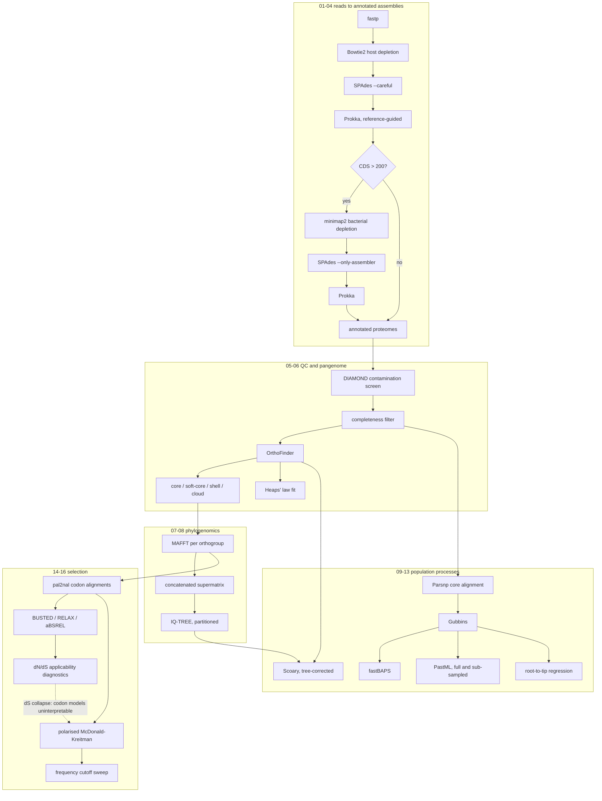

# Pipeline overview

## Why the diagnostic arrow matters

The dashed edge is the analytical hinge of the study. The codon-model scans are
not run because they are expected to work; they are run to establish, with
recorded evidence, that they cannot work on a clonal population with almost no
synonymous variation. `SELECTION_DIAGNOSTICS` writes that evidence out per gene:
the number of distinct protein haplotypes, the proportion of sites with dS
approximately zero, and whether the likelihood-ratio statistic degenerated.
Only then does the population-genetic test become the primary result rather than
an alternative one.

## Stage inputs and outputs

| Stage | Key input | Key output | Tool |
|---|---|---|---|
| 01 | raw FASTQ | trimmed reads | fastp |
| 02a | trimmed reads | host-depleted reads | Bowtie2 |
| 02b | flagged reads | bacterially depleted reads | minimap2, samtools |
| 03 | depleted reads | filtered contigs | SPAdes |
| 04 | contigs | proteome, CDS, GFF | Prokka |
| 05 | proteomes | retained genome list | DIAMOND |
| 06 | retained proteomes | orthogroups, presence/absence | OrthoFinder |
| 07 | single-copy orthogroups | supermatrix, partitions | MAFFT |
| 08 | supermatrix | ML tree | IQ-TREE |
| 09 | genomes | core alignment, recombination blocks, r/m | Parsnp, Gubbins |
| 10 | recombination-free SNPs | genetic clusters | fastBAPS |
| 11 | filtered tree, metadata | ancestral states, sub-sampling control | PastML |
| 12 | filtered tree, dates | root-to-tip regression | Biopython |
| 13 | presence/absence, traits, tree | gene-trait associations | Scoary |
| 14 | codon alignments, tree | episodic and branch selection | HyPhy |
| 15 | codon alignments | polarised alpha, threshold sweep | in-house |

## Resource notes

Bacterial depletion maps against a ~100 GB minimap2 index and carries the
`process_high_memory` label. OrthoFinder and Gubbins are the two other stages
that dominate wall time on a full dataset. The HyPhy stages are numerous and
individually small, so they carry `errorStrategy = 'ignore'`: a per-gene
optimisation failure is a recorded diagnostic, not a pipeline failure, and the
diagnostics stage counts those failures explicitly.
